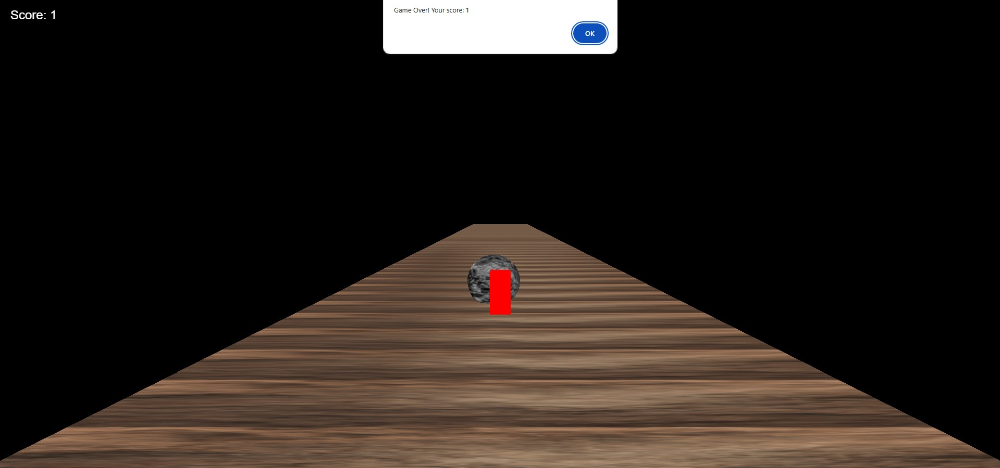

# Running Game (3D) - Three.js Implementation

This is a simple 3D game inspired by *Subway Surfers* built using [Three.js](https://threejs.org/). Players control a character navigating a dynamic environment, avoiding obstacles (textured rocks), and collecting coins to increase their score.



---

## Features

- **Dynamic Environment**: The ground moves continuously to simulate player motion.
- **Obstacles**: Rocks with realistic textures spawn dynamically and must be avoided.
- **Coins**: Collectible coins increase the player's score.
- **Increasing Difficulty**: Game speeds up over time reducing reaction time.
- **Collision Detection**: Alerts the player when they collide with an obstacle and restarts the game.
- **Keyboard Controls**: 
  - Arrow keys (`←` and `→`) to move the player left or right.

---

## Gameplay Instructions

1. **Objective**: Navigate through the environment, avoid rocks, and collect as many coins as possible.
2. **Controls**:
   - Use the **Left Arrow (`←`)** key to move left.
   - Use the **Right Arrow (`→`)** key to move right.
3. **Scoring**:
   - Collect coins to increase your score by 1 for each coin.
   - Avoid obstacles (rocks) as colliding with one will end the game.

---

## Installation and Setup

### Prerequisites
- A modern web browser (e.g., Chrome, Firefox, or Edge) with WebGL support.
- A text editor or IDE for editing code (optional, e.g., VS Code).

### Steps
1. Clone or download the repository:
   ```bash
   git clone https://github.com/wmai0417/Running-Game
   ```
2. Navigate to the project folder:
   ```bash
   cd Running-Game
   ```
3. Open `r.html` in your web browser:
   - Double-click the file in your file manager, or
   - Serve the project using a local server (e.g., Python's HTTP server):
     ```bash
     python3 -m http.server
     ```

---

## Project Structure

- **`index.html`**: The main HTML file containing the game logic and rendering setup.
- **Assets**:
  - Textures for ground (`https://plus.unsplash.com/premium_photo-1673828332632-17fe468ed31e?q=80&w=1964&auto=format&fit=crop&ixlib=rb-4.0.3&ixid=M3wxMjA3fDB8MHxwaG90by1wYWdlfHx8fGVufDB8fHx8fA%3D%3D`) and rocks (`https://images.unsplash.com/photo-1599389931990-ffb2373161b5?q=80&w=1974&auto=format&fit=crop&ixlib=rb-4.0.3&ixid=M3wxMjA3fDB8MHxwaG90by1wYWdlfHx8fGVufDB8fHx8fA%3D%3D`) are loaded directly from URLs.

---

## Technologies Used

- **Three.js**: A JavaScript library for 3D rendering and animations.
- **HTML5**: Structure of the game interface.
- **CSS**: Basic styling for UI components like the scoreboard.

---

## Controls Overview

| Action                  | Key(s)       |
|-------------------------|--------------|
| Move Player Left        | Left Arrow ← |
| Move Player Right       | Right Arrow → |

---

## How to Play

1. Start the game by opening the `index.html` file.
2. Use the arrow keys to navigate the player character left and right.
3. Avoid rocks and collect coins to increase your score.
4. When you collide with a rock, the game will restart, and your score will reset.

---

## Future Enhancements

Potential improvements for this project include:
- Adding power-ups (e.g., temporary invincibility or coin multipliers).
- Implementing multiple difficulty levels with varying speeds.
- Introducing a high-score system to track player achievements.
- Adding sound effects and background music for a more immersive experience.

---

## Contributors

- **[William Mai] - Developer


---

## Acknowledgments

- Textures sourced from:
  - [Rock Texture](https://images.unsplash.com/photo-1599389931990-ffb2373161b5?q=80&w=1974&auto=format&fit=crop&ixlib=rb-4.0.3&ixid=M3wxMjA3fDB8MHxwaG90by1wYWdlfHx8fGVufDB8fHx8fA%3D%3D)
  - [Ground Texture](https://plus.unsplash.com/premium_photo-1673828332632-17fe468ed31e?q=80&w=1964&auto=format&fit=crop&ixlib=rb-4.0.3&ixid=M3wxMjA3fDB8MHxwaG90by1wYWdlfHx8fGVufDB8fHx8fA%3D%3D).

---


